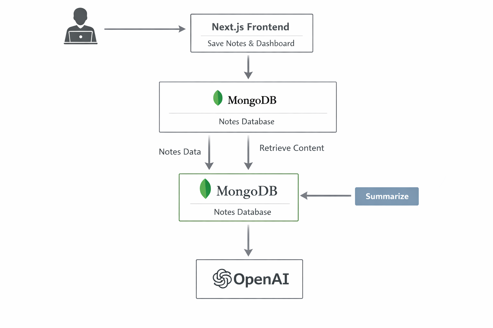

# Mind Vault (Second Brain AI 🧠)
MindVault is an AI-powered knowledge assistant that allows users to store notes, summarize content, and ask intelligent questions based on their personal knowledge base.
It functions as a context-aware second brain, helping users quickly retrieve and understand stored information.

## 🌐 Live Demo :
- Visit project at - 
https://mind-vault-rosy.vercel.app/

## 🏗️ Architecture :

- Visit docs.md to know more about architecture

## 🚀 Features
- Upload and manage personal notes
- AI-powered note summarization
- Context-aware “Ask AI” question answering
- Search notes efficiently
- Clean and responsive modern UI
- Modular architecture designed for scalability

## 🧠 How It Works
MindVault processes and stores user notes, allowing AI to generate summaries and contextual answers using stored knowledge.

### Core Flows

### Note Upload
- Users upload notes
- Notes are stored in MongoDB
- Metadata indexed for retrieval
### Summarization
- User triggers summarization
- Note content is retrieved
- AI generates summary
- Summary stored for reuse
### Ask AI
- User asks a question
- Relevant notes are retrieved
- Context + query sent to AI
- AI returns contextual answer

## 🛠️ Tech Stack
### Frontend
- Next.js (App Router)
- React
- Tailwind CSS
- Framer Motion
- Lenis
### Backend
- Next.js Server Actions
- Node.js runtime
### Database
- MongoDB
### AI Integration
- OpenAI API (summarization and Q&A)


## ⚙️ Setup instructions
1️⃣ Clone the Repository
```bash
git clone https://github.com/rohitgnan/mindvault.git

```
2️⃣ Go to the project directory

```bash
   cd mindvault
```

3️⃣ Install Dependencies

```bash
  npm install
  npm install mongoose
  npm install openai
  npm install framer-motion
  npm install studio-freight/lenis
  npm install lucid-react
```

4️⃣ Environment Variables - [
Create a .env.local file using the example ] :

```bash
 cp .env.example .env.local
```
5️⃣ Run the Application

```bash
  npm run dev
```
6️⃣ Open the app at:

```bash
  http://localhost:3000
```

## Demo Video
[](https://youtu.be/AG7zDwq7oFs?si=2iPilA5VYboDvpcp)